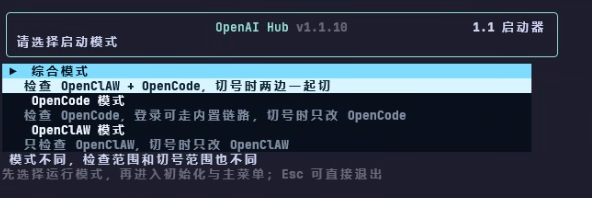
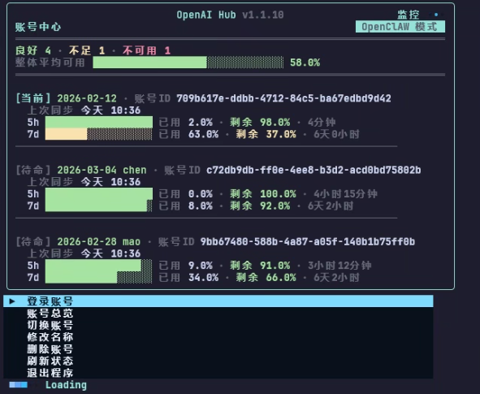

# OpenAI Hub 1.1

OpenAI Hub 是一个给 OpenClAW 和 OpenCode 使用的账号池启动器。

它把多个 GPT 账号整理成统一账号池，让你可以用一个入口完成登录、管理、切换和同步，而不是在不同目录和不同工具之间来回手动改配置。

如果你手里有多个 GPT 账号，要轮流给 OpenClAW 或 OpenCode 使用，OpenAI Hub 的价值就是把这些重复操作收拢成一次安装、一个命令、一个统一入口。

你可以用它来：

- 统一保存账号登录状态
- 维护可切换的账号池
- 一键切换当前账号
- 同步 OpenClAW 和 OpenCode 的使用配置
- 在进入主界面前先做环境检查

一句话说清楚：

> OpenAI Hub 不是聊天工具本体，而是给 OpenClAW / OpenCode 使用的账号池管理与切号入口。

## 下载或更新

推荐命令：

```bash
npm install -g openaihub
```

这是一条安装和更新通用命令，也是当前唯一推荐的安装方式。

安装完成后，重新打开终端，运行：

```bash
openaihub
```

或者：

```bash
OAH
```

说明：

- 当前只推荐使用 `npm install -g openaihub`
- npm 安装链路按平台区分运行时：Windows x64、macOS arm64、macOS x64
- GitHub Release 里的平台资产是给 npm 安装器拉取运行时用的，不再作为单独给用户的安装入口

安装后默认目录：

- Windows：`%USERPROFILE%/.openaihub`
- macOS：`$HOME/.openaihub`

命令入口默认目录：

- Windows：`%USERPROFILE%/.openaihub/bin`
- macOS：`$HOME/.openaihub/bin`

## 为什么要用 OpenAI Hub

- 把多个 GPT 账号整理成统一账号池
- 用一个入口同时服务 OpenClAW 和 OpenCode
- 少做手动改配置、手动换号、手动同步这些重复动作
- 启动前先检查环境，减少因为目录或配置缺失导致的报错

## 适合什么人使用

- 你有多个 GPT 账号，需要轮流给 OpenClAW 或 OpenCode 使用
- 你不想每次都手动改配置、手动替换账号
- 你希望把账号池集中管理，而不是散落在不同目录里
- 你希望进入程序前先自动检查环境，避免进了主界面才发现缺文件

如果你只有一个账号，也不需要切号，这个工具对你的价值就不会那么大。

## 卸载

```bash
npm uninstall -g openaihub
```

## 版本

```bash
openaihub --version
```

## 快速开始

如果你是第一次使用，推荐按这个顺序来：

### 第一步：确认电脑里已经有 npm

请先在终端里执行：

```bash
npm -v
```

如果这条命令能正常输出版本号，说明你已经有 npm，可以直接安装 OpenAI Hub。

如果这条命令报错，说明你的电脑里还没有 npm。你需要先安装 Node.js（安装 Node.js 时通常会一起带上 npm）。

### 第二步：安装 OpenAI Hub

推荐优先使用：

```bash
npm install -g openaihub
```

### 第三步：确认 OpenClAW / OpenCode 已经生成默认目录

在你第一次正式使用前，建议至少先让对应的软件自己运行过一次。

原因很简单：OpenAI Hub 不是凭空生成你所有宿主软件环境，它会去检查这些软件已经存在的默认目录和配置文件。

### 第四步：启动 OpenAI Hub

```bash
openaihub
```

或：

```bash
OAH
```

### 第五步：选择模式

启动后，先选模式，再初始化，再进入主页面。

## 程序截图





## 模式对照表

| 模式 | 会检测什么 | 会切换什么 | 适合谁 |
| --- | --- | --- | --- |
| 综合模式 | OpenClAW + OpenCode | 两边一起切 | 两边都在用，想统一管理 |
| OpenCode 模式 | OpenCode | 只切 OpenCode | 主要用 OpenCode，登录可走内置链路 |
| OpenClAW 模式 | OpenClAW | 只切 OpenClAW | 只想管理 OpenClAW |

## 这个产品是干什么的

OpenAI Hub 主要解决的是“一个人手里有多个 GPT 账号，需要把这些账号稳定轮换给 OpenClAW 和 OpenCode 去使用”的问题。

它的主要用途是：

- 把多个 GPT 账号组成一个号池
- 登录并保存这些账号
- 查看当前账号状态
- 在账号之间切换
- 在需要的时候自动把账号切给 OpenClAW 和 OpenCode

所以它更像是一个账号池调度器，而不是单独的聊天软件。

## 使用前你需要准备什么

### 1. 综合模式 / OpenClAW 模式必须有 OpenClAW

这是必须项。

如果你选择的是综合模式或 OpenClAW 模式，OpenAI Hub 会要求本机已经安装并初始化过 OpenClAW。

这两种模式下会检查：

- 综合模式
- OpenClAW 模式

初始化时都会检查 OpenClAW 相关目录。

程序当前会重点检测这些默认位置：

- OpenClAW 根目录：`~/.openclaw`
- OpenClAW 配置文件：`~/.openclaw/openclaw.json`
- OpenClAW agent 目录：`~/.openclaw/agents`
- OpenAI Hub 账号池文件：`~/.openaihub/openai-codex-accounts.json`
- OpenAI Hub 程序状态文件：`~/.openaihub/openai-hub-state.json`
- OpenAI Hub 切号日志：`~/.openaihub/logs/switch-events.jsonl`

如果你设置了 `OPENCLAW_STATE_DIR`，OpenAI Hub 会优先按这个目录去查 OpenClAW 的状态根目录。

如果缺少下面这些关键内容，程序会报错或阻止进入主页面：

- `~/.openclaw/openclaw.json` 不存在
- `~/.openclaw/agents` 不存在
- `~/.openclaw/agents/*/agent` 目录没有建立
- OpenClAW 配置里缺少程序要求的模型项

默认建议：

- 让 OpenClAW 使用默认用户目录 `~/.openclaw`
- 先正常安装并至少初始化一次 OpenClAW
- 确保它已经生成自己的配置和 agent 目录

macOS 用户同样按这个默认目录检测：

- `~/.openclaw/openclaw.json`
- `~/.openclaw/agents`
- `~/.openaihub/openai-codex-accounts.json`
- `~/.openaihub/openai-hub-state.json`
- `~/.openaihub/logs/switch-events.jsonl`

### 2. 如果你要用 OpenCode 模式或综合模式，就还需要 OpenCode

这两种模式下，程序还会检查 OpenCode 的配置与认证文件。

如果你使用的是 OpenCode 模式，当前版本不再强制要求本机安装 OpenClAW 程序；登录可走程序内置链路，账号池和程序状态默认保存在 `~/.openaihub` 下。

当前检测的默认位置是：

- OpenCode 配置文件：`~/.config/opencode/opencode.json`
- OpenCode 凭据文件：`~/.local/share/opencode/auth.json`

在 macOS 上，如果检测到 `~/Library/Application Support/opencode/auth.json` 已存在，程序也会优先使用该认证文件。

如果缺少下面这些关键内容，程序会报错或阻止进入主页面：

- `~/.config/opencode/opencode.json` 不存在
- `~/.local/share/opencode/auth.json` 不存在
- OpenCode 配置里缺少程序要求的模型项

默认建议：

- 让 OpenCode 使用默认目录
- 先正常安装一次 OpenCode
- 至少让 OpenCode 生成它自己的配置文件和认证文件

## 当前状态

- npm 包将发布：`openaihub@1.1.15`
- npm 安装命令已可直接使用
- 已验证命令：`openaihub`、`OAH`、`openaihub --version`
- npm 安装链按平台拉取 Windows / macOS 对应运行时
- GitHub Release 平台资产用于 npm 运行时分发，不再作为单独安装入口
